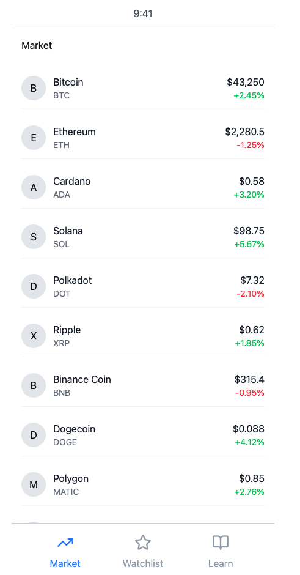
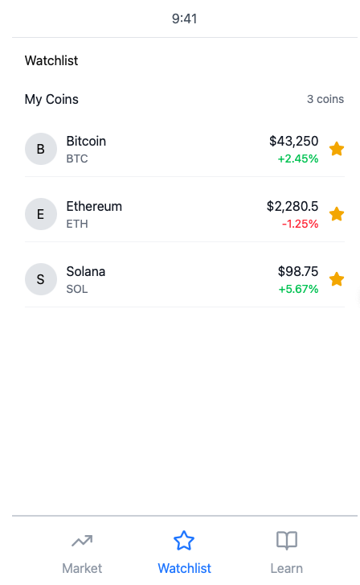

# Headline Hub V1

## Table of Contents

1. [Overview](#Overview)
2. [Product Spec](#Product-Spec)
3. [Wireframes](#Wireframes)
4. [Schema](#Schema)

## Overview
Here's a walkthrough  of implemented features:

### Features

- []  User sees a list of the latest news headlines immediately upon opening the app.
    - [] User can click on each item and navigate to the details page of the news article.
  - []  User can filter news by title or description.

- []  On the details page, user can see the source, author, publish date, image, and description of the article.
    - [] User can mark an article as "Favorite" by clicking the star button.
    - [] User can mark an article as "Read Later" by clicking on the bookmark button to save for later.
    - [] User can click a button to navigate to an external link containing the full article.
- [] On the Favorite page, user can see a list of articles that they have marked already as favorite.
- []  On the Read Later page, user can see a list of articles that they have marked to read later.
  

- [] The app uses a **Tab Bar** for navigation:
    - **News** (All news)
    - **Favorites** (Favorited article)
    - **Read later** (Read later)

### Description

Headline Hub uses the News API to display breaking news headlines in real time. Users can filter articles, save favorites, and manage a personalized reading list.

### App Evaluation

### 1. Headline Hub
- **Description:** A real-time news app that delivers top headlines tailored to the user’s interests and location. Users can follow categories such as technology, sports, world news, entertainment, and more.
- **Mobile:** Mobile is ideal for instant push notifications, location-aware updates, and quick scrolling through brief summaries or headlines.
- **Story:** Helps users stay informed with timely, relevant news while reducing information overload. Prioritizes meaningful stories and avoids sensational or repetitive content to maintain clarity and trust.  
- **Market:** Appeals to students, professionals, travelers, and anyone who wants reliable updates without endless scrolling. Especially valuable for younger audiences seeking alternatives to traditional news outlets.  
- **Habit:** Encourages multiple daily check-ins or passive engagement through notifications. Personalized alerts and topic-based feeds support ongoing usage.  
- **Scope:**  
  - **V1:** Main news feed + title and description filtering.  
  - **V2:** Local news integration + custom keyword subscriptions.  
  - **V3:** Advanced personalization such as article recommendations, reading behavior insights, and sentiment-based filtering, breaking news alerts.

## Product Spec

### 1. User Stories (Required and Optional)

**Required Must-have Stories**

* As a user, I want to see a list of the latest breaking news headlines as soon as I open the app.  
* As a user, I want to read an article's description and have a link to open the full article.  
* As a user, I want to mark articles as **Favorite** by clicking the star button.  
* As a user, I want to mark articles to **Read Later** by clicking the bookmark button.  
* As a user, I want to filter articles by title or description to quickly find relevant news.  
* As a user, I want my saved articles (Favorites and Read Later) to persist across app sessions.
* As a user, I want the app to load quickly and have a clean, simple UI that is easy to navigate.

**Optional Nice-to-have Stories (Future Implementation)**

* As a user, I want to see category-specific news feeds (e.g., sports, technology, world, entertainment).  
* As a user, I want to receive push notifications for breaking news.  
* As a user, I want to share articles via social media or messaging apps.  
* As a user, I want to see recommended articles based on my reading habits.

### 2. Screen Archetypes

**Market View (Home)**
* As a user, I want to see a list of top cryptocurrencies with price and 24h change as soon as I open the app.
* As a user, I want to tap on a coin to view more details about it.

**Coin Details View**
* As a user, I want to see more in-depth information about the selected cryptocurrency (price, market cap, volume, description).
* As a user, I want to add or remove the coin from my Watchlist using a favorite/star button.
* As a user, I want the option to open the coin’s official website or external resources for more info.

**Watchlist View**
* As a user, I want to see a list of the cryptocurrencies I have marked as favorites.
* As a user, I want this list to update automatically when I add or remove coins.
* As a user, I want my watchlist to persist when I close or reopen the app.

**Learn / Info View (optional third tab)**
* As a user, I want to see basic explanations about cryptocurrency concepts (e.g., market cap, blockchain, how wallets work).
* As a user, I want this section to be simple and easy to understand.

### 3. Navigation

**Tab Navigation** (Tab to Screen)

- **News** → Main headlines feed  
- **Favorites** → Favorite articles  
- **Read Later** → Saved articles 

**Flow Navigation** (Screen to Screen)

**Market View**
  - Tap headline → **Article Details**
  - Switch tabs → **Favorites** or **Read Later**

**News Details View**
- Tap star button → add/remove **Favorite**
- Tap bookmark button → add/remove **Read Later**
- Switch tabs → **News**, **Favorites**, **Read Later**

**Favorites / Read Later**
  - Tap article → **Article Details**
  - Switch tabs → **News** or the other list

## Wireframes

### [BONUS] Digital Wireframes & Mockups

### [BONUS] Interactive Prototype

## Schema 

### Models

[Add table of models]

### Networking

-API: `[https://api.coingecko.com/api/v3/coins/markets?vs_currency=usd]`
